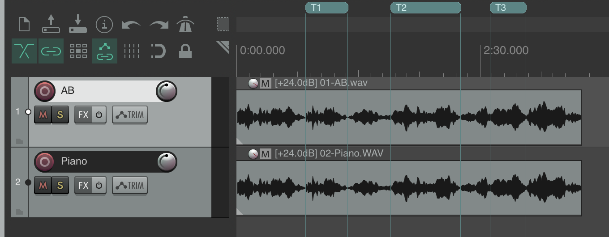
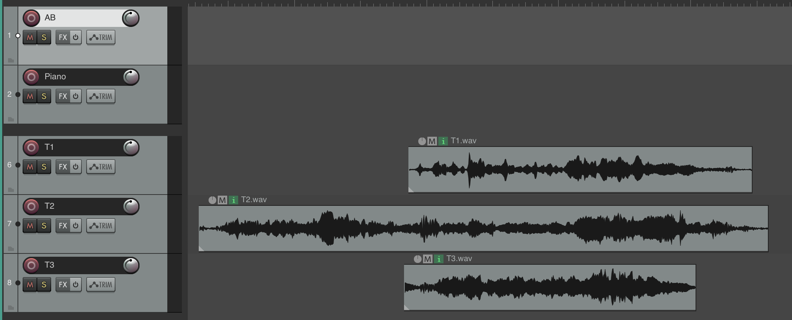
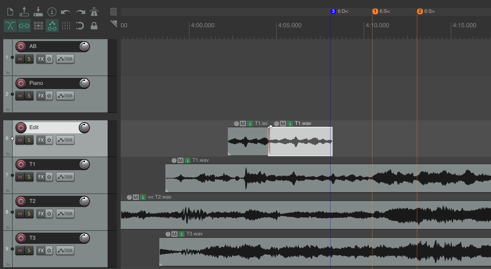
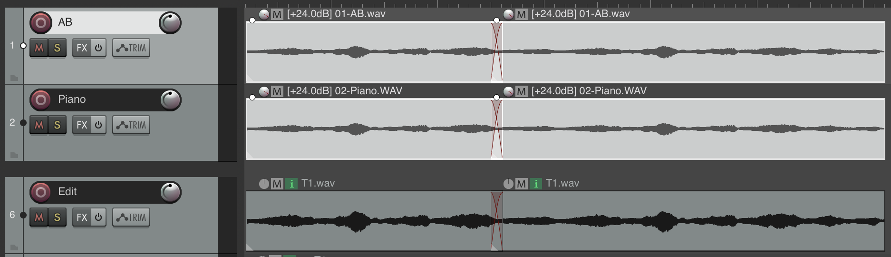

# REAPER Edit Tools

Standalone Lua scripts for editing multitrack audio with ease in REAPER.

## Workflow

### 1. Create regions representing different takes

First, define takes as regions. If you started/stopped your audio recorder neatly around each take, this will be trivial. Otherwise, create regions around every valuable take of audio and name the regions as you like.

### 2. Render those regions to audio files (proxy items)

Rough-mix and render all those regions to disk and reimport them. These become proxies for the multi-track audio.

### 3. Re-import and stack proxy items vertically to compare takes

This lets you stack the takes to align them vertically and easily choose between takes of identical musical material. In case you want them ordered by when they start in the audio, run `reorder_tracks_by_first_item_timestamp`. You can solo and play a given take by running the `solo_track_play_from_mouse` script.

### 4. Pick your favorite edits from each take

Then, create an edit from these proxy files. You can do this manually or use the source/destination (3-point) editing scripts. Click on a source track, set in/out, click a dest track, and set in or out. Run `source_destination_edit` to insert the given material from source to dest.

### 5. Convert selected proxies back to multitrack audio for detailed mixing

Finally, you'll want to convert your proxies back to multitrack audio for detailed mixing. Do this with `convert_proxies_to_multitrack`.

### 6. Export to video editing software (optional)

If you're working with video editing software that accepts OpenTimelineIO (DaVinci Resolve, Adobe Premiere, Final Cut Pro), then you can select your edited proxies and convert them into an OTIO file to import them in your video editing software with the `selected_items_to_otio` script.

**Note:** These scripts intentionally don't require a specific project structure. But if you're used to adding plugins to the master bus, you might want to create a folder around the original multitrack channels to use as the bus, and that way master bus doesn't get re-applied to the proxies.

Drop scripts into REAPER's Scripts folder and assign to actions for quick access.